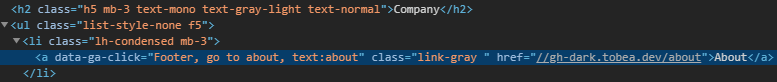

In this article I'll be showing you how you can make a proxy that serves Github in dark mode. We'll be creating a serverless function that serves as the proxy and deploying to [Now](https://zeit.co/now). We'll use Now's configuration file to route all traffic through a single endpoint: `index.js`. 

## What's A Proxy?
TLDR;

Proxy's serve as a layer between you and the rest of the internet by providing things like extra security, privacy, access to blocked resources, etc.

There's also a [longer read](https://www.varonis.com/blog/what-is-a-proxy-server/) that dives deeper into what a proxy is and what it can do. Along with the **potential risks** associated with using one.

## What's A Serverless Function?
TLDR;

Serverless functions can be broken down simply as _a software design patter where applications are hosted by a third-party service_, which eliminates the need for a developer to manage a server with hardware and/or software. In other words, you push your code and tell the service how to handle it. 

The [Twilio docs](https://www.twilio.com/docs/glossary/what-is-serverless-architecture) have a really good explanation diving into greater detail about serverless functions.

## Let's Get Started
This is going to be pretty short. All we really need to get this working is 2 files: `index.js` and `dark.css`. We need a CSS file to send along to enable dark mode. I'm using this [Github-Dark](https://github.com/StylishThemes/GitHub-Dark) style, but you could always find another one that works best for you.

Now that we have our dark style CSS for Github at the root of out project, we can start working on our JavaScript. First thing we need is a way to async-fetch pages from Github, I like to use the `node-fetch`.

`npm i node-fetch`

And let's set the groundwork:

```js
const fetch = require('node-fetch');

module.exports = async (req, res) => {
  const html = (await (await fetch(`https://github.com${req.url}`)).text())

  res.end(html);
};
```

Awesome! Now we can navigate Github through our proxy. I'm using [Now](https://zeit.co/now) to deploy this as a function. This requires some extra setup through the `now.json` configuration file to make sure all of the routes hit out `index.js`, and also that Now is building and serving our assets correctly:

`now.json`
```json {3-4, 7-8}
{
  "version": 2,
  "routes": [
    { "src": "/dark\\.css", "dest": "dark.css" },
    { "src": "/.*", "dest": "index.js" }
  ],
  "builds": [
    { "src": "index.js", "use": "@now/node" }, 
    { "src": "dark.css", "use": "@now/static" }
  ]
}
```

Once we deploy we should be able to navigate Github through our proxy:


From this point, we're presented with two issues:
1. Any link that points to `https://github.com/...` will throw us to Github instead of continue through the proxy
2. We're not applying the dark mode styling

We're already converting our HTML tp text, so let's replace any `github.com` links with our host URL:

```js {6}
const fetch = require('node-fetch');

module.exports = async (req, res) => {
  res.setHeader('Cache-Control', 's-maxage=3, stale-while-revalidate');
  const html = (await (await fetch(`https://github.com${req.url}`)).text())
    .replace(/(href=.)https?:\/\/github.com/g, `$1//${req.headers.host}`);
    
  res.end(html);
};
```

> If you're having trouble understanding the '$1' in the second argument of `.replace()`, have a look at the documentation on [MDN](https://developer.mozilla.org/en-US/docs/Web/JavaScript/Reference/Global_Objects/String/replace#Description) <span class="normal">😀</span>

Great! If we take a look at each new page that we're fetching, we should see that some links are being changed to provide the host url:



Onto the last issue of adding the dark mode styles to the site. You might think that it makes sense to just take the contents of the file, and put it in a style tag somewhere in the html that we're grabbing on each fetch. While that is an option, we can make that a little cleaner:

```js {7-10}
const fetch = require('node-fetch');

module.exports = async (req, res) => {
  res.setHeader('Cache-Control', 's-maxage=3, stale-while-revalidate');
  const html = (await (await fetch(`https://github.com${req.url}`)).text())
    .replace(/(href=.)https?:\/\/github.com/g, `$1//${req.headers.host}`)
    .replace(
      '</head>',
      '<link media="all" href="/dark.css" rel="stylesheet" /></head>'
    );
  
  res.end(html);
};
```

Just add a link tag with the relative path to the asset 🥳 Because we're serving the content from our function, we can also pass along files that exist from the same source - i.e. our `dark.css`. After we publish all of those changes, we can now freely browse Github in dark mode through our proxy 🎉


## Something You Should Know
A proxy can be a bit of a double edged sword when it comes to privacy and security. Organizations have and to this day use proxys to monitor employee activity amongst other things. Because a proxy's main feature is processing the traffic that passes through it, it can do a lot of things with that data. You should take care with the actions you take when using a proxy.

What I'm _specifically_ doing here is doing checks and routing traffic through a single endpoint that transforms the `<head>` and some links to achieve proper routing and the dark theme for Github. I could write something that modifies inputs on the login page to do whatever I want. I'm not doing that, and my deployment is [public](https://zeit.co/devjmetivier/github-dark-proxy/n9ryltgq4) so that can be confirmed. The lesson is that if you're not absolutely sure what a third party proxy is doing, you shouldn't be doing any actions that could cause self-harm.
