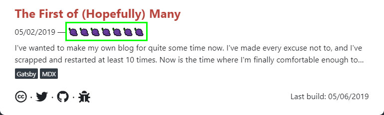
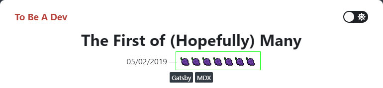

This one is a short but fun one. In this article I'm going to show you how I represent TTR (time to read) in emojis on my personal blog. This article is going to be going off the assumption that you're using [Gatsby](https://www.gatsbyjs.org) for your static site generator. Passing `unique` emojis to be used in each page requires the passing of data at the build level when using Gatsby. We also need to make those emojis consistent between the article directory and the article itself:

### Directory:


### Article:


## Grab A List of Emojis
This is pretty straight forward. I like to use fruits, so that's what I'll be using. Of course, you could use whatever emojis you want. Make a file with an array of emojis that you can reference from.

`emoji.js`
```js
exports.emojis = ['🍇', '🍈', '🍉', '🍊', '🍋', '🍌', '🍍'];
```

## Understand Your createPages in Gatsby
Your mileage may vary with this. I'm using MDX in my blog. Most Gatsby sites at the moment are probably using `gatsby-transformer-remark` when querying their pages inside of their `createPages` build method. In that case, you can replace the following `allMdx` query with the `allMarkdownRemark` query inside of your call to graphql.

In your `gatsby-node.js`:
```js
exports.createPages = async ({ graphql, actions }) => {
  const { createPage } = actions;

  const postTemplate = require.resolve('./src/templates/post.js');

  const result = await wrapper(
    graphql(`
      {
        allMdx(sort: { fields: [frontmatter___date], order: DESC }) {
          edges {
            node {
              fields {
                slug
              }
              frontmatter {
                title
                categories
              }
            }
          }
        }
      }
    `)
  );
}
```

Above I'm just grabbing all of my posts by order of date in descending order. I want to list my articles in order from most recent to oldest. It makes sense to do this during the build so that when I loop over the array of articles in my article directory I don't have to sort them.

## Loop Over Your Pages And Inject The Emoji As Props

My query returns an array of `edges` which consist of all the data needed to create my articles. I can extract those edges and loop over them to create individual pages. Let's also import our emojis from `emoji.js`:

```js {2,8-19}
// we have to use require() in gatsby-node.js
const { emojis } = require('./config/emojis');
//...

exports.createPages = async ({ graphql, actions }) => {
  //...
  
  const posts = result.data.allMdx.edges;
  
  posts.forEach((edge, index) => {
    createPage({
      path: edge.node.fields.slug,
      component: postTemplate,
      context: {
        slug: edge.node.fields.slug,
        emoji: emojis[index],
      },
    });
  });
}
```

Here's where it get's tricky. Because we're ordering the articles in descending order, we have to reverse the order at which we're referencing our array. If we don't do this, each new article (the first in the list) would always inherit the first emoji in our emojis array. This looks bad because we want the older articles to retain their emojis as more are added to the article directory. So let's reverse the order in which we're passing emoji info to the page using computer science magic 🧝🏻‍♀️

```js {6}
exports.createPages = async ({ graphql, actions }) => {
  //...
  
  const posts = result.data.allMdx.edges;
  
  const reverseEmojiOrder = index => posts.length - 1 - index;
  
  posts.forEach((edge, index) => {
    createPage({
      //...
      context: {
        //...
        emoji: emojis[reverseEmojiOrder(index)],
      },
    });
  });
}
```

**Breakdown:**
* Pass in the index of the current item in your loop to the `reverseEmojiOrder()` function
* Grab the length of the array you're looping over
* Subtract `1` from the length because arrays start from indices of `0`
* Subtract the current index you passed in

This ensures that you're working backwards from any starting index of emojis you have in your array. And that's about it! Your emoji prop is passed to your page template, and you can use it however you like.

## Use Similar Techniques On Your Homepage 
In order for your emojis to be the same from index to post, you must implement the same technique when looping over a list of articles. In my `index.js` page, I have a similar query:

```js
export const IndexQuery = graphql`
  query IndexQuery {
    allMdx(sort: { fields: [frontmatter___date], order: DESC }) {
      edges {
        node {
          fields {
            slug
          }
          frontmatter {
            title
            date
            categories
          }
          excerpt(pruneLength: 200)
          timeToRead
        }
      }
    }
  }
`;
```

Again, I'm sorting all of my articles by date in descending order. When I loop over my list of articles, I pass an emoji from my emojis array in reverse order.
